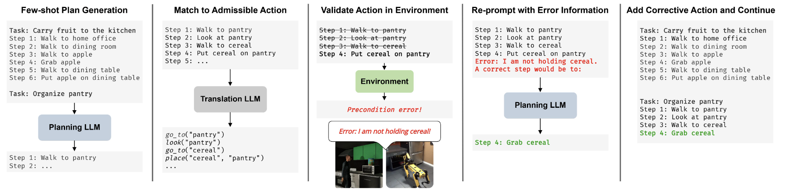

## CAPE: Corrective Actions from Precondition Errors using Large Language Models

#### [[Project Page]](https://shreyas-s-raman.github.io/CAPE/) [[Paper]](https://ieeexplore.ieee.org/abstract/document/10611376) [[ArXiV]](https://arxiv.org/abs/2211.09935)

[Shreyas S Raman](https://shreyasraman.netlify.app/)<sup>1</sup>, [Vanya Cohen](https://www.cs.utexas.edu/~ai-lab/people-view.php?PID=553)<sup>2</sup>, [Ifrah Idrees](https://scholar.google.com/citations?user=OM1hDLcAAAAJ&hl=en)<sup>1</sup>, [Eric Rosen](https://eric-rosen.github.io/)<sup>1</sup>, [Raymond J Mooney](https://www.cs.utexas.edu/~mooney/)<sup>2</sup>, [David Paulius](https://davidpaulius.github.io/)<sup>1</sup>, , [Stefanie Tellex](https://vivo.brown.edu/display/stellex)<sup>1</sup>

<sup>1</sup>Brown University, <sup>2</sup>The University of Texas Austin<br/>



This is the official code for our [CAPE: Corrective Actions from Precondition Errors using Large Language Models](https://shreyas-s-raman.github.io/CAPE/) paper. Our explicit prompting approach enables embodied LLM agents to generate plans for for complex tasks (e.g. "make breakfast") that are more semantically correct and executable whilst minimizing re-prompting -- without requiring any fine-tuning. The code can be used with any available language models from [OpenAI API](https://openai.com/api/) and [Huggingface Transformers](https://huggingface.co/docs/transformers/index) with a common interface.


If you find this work useful in your research, please cite using the following BibTeX:

```bibtex
@inproceedings{raman2024cape,
      title={{CAPE: Corrective Actions from Precondition Errors using Large Language Models}},
      author={Sundara Raman, Shreyas and Cohen, Vanya and Paulius, David and Idrees, Ifrah and Rosen, Eric and Mooney, Ray and Tellex, Stefanie},
      booktitle={2024 IEEE International Conference on Robotics and Automation (ICRA)},
      year={2024},
      note={(In Review)}
    }
```

### Setup Instructions
```Shell
git clone git@github.com:Shreyas-S-Raman/corrective_actions_precondition_errors.git
cd language-planner/
conda create --name cape-env python=3.6.13
conda activate cape-env
pip install --upgrade pip
pip install -r requirements.txt
```


**Note:**
- It is observed that best results can be obtained with larger language models. If you cannot run [Huggingface Transformers](https://huggingface.co/models?pipeline_tag=text-generation&sort=downloads) models locally or on Google Colab due to memory constraint, it is recommended to register an [OpenAI API](https://openai.com/api/) account and use GPT-3 or Codex (As of 01/2022, $18 free credits are awarded to new accounts and Codex series are free after [admitted from the waitlist](https://share.hsforms.com/1GzaACuXwSsmLKPfmphF_1w4sk30?)).
- Due to language models' high sensitivity to sampling hyperparameters, you may need to tune sampling hyperparameters for different models to obtain the best results.
- The code uses the list of available actions supported in [VirtualHome 1.0](https://github.com/xavierpuigf/virtualhome/tree/v1.0.0)'s [Evolving Graph Simulator](https://github.com/xavierpuigf/virtualhome/tree/v1.0.0/simulation). The available actions are stored in [`available_actions.json`](https://github.com/huangwl18/language-planner/blob/main/src/available_actions.json). The actions should support a large variety of household tasks. However, you may modify or replace this file if you're interested in a different set of actions or a different domain of tasks (beyond household domain).
- A subset of the [manually-annotated examples](http://virtual-home.org/release/programs/programs_processed_precond_nograb_morepreconds.zip) originally collected by the [VirtualHome paper](https://arxiv.org/pdf/1806.07011.pdf) is used as available examples in the prompt. They are transformed to natural language format and stored in [`available_examples.json`](https://github.com/huangwl18/language-planner/blob/main/src/available_examples.json). Feel free to change this file for a different set of available examples.